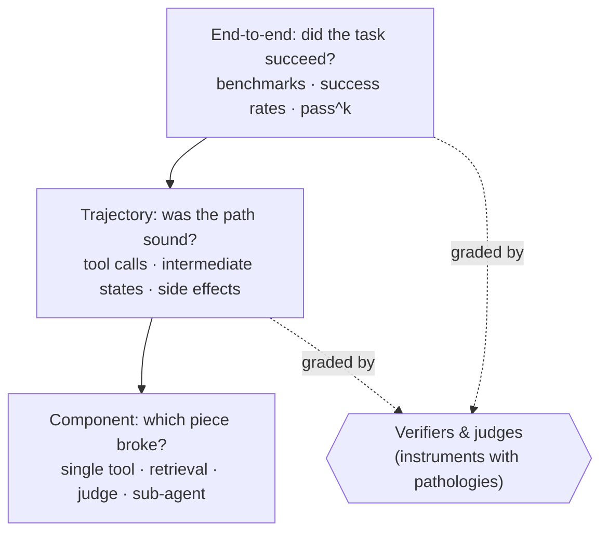

# Awesome Agent Eval 

> An unmeasured agent is an unfinished agent.

A curated list of resources on **evaluating AI agents** — trajectory-level evaluation, agentic benchmarks and their pathologies, verifier design, LLM-as-judge, observability, and production eval loops.

[中文版 →](README.zh-CN.md) · Sibling list: [awesome-ai-harness](https://github.com/Vendredi218/awesome-ai-harness) — *you cannot tune a harness you cannot measure; this list is the measuring half.*

---

## Why this list

Model evaluation and agent evaluation are different disciplines wearing the same name. A model answers once; an agent runs for fifty turns, calls tools, mutates real state, and fails in ways a final-answer check never sees. Between 2025 and 2026 the field learned this the hard way: headline benchmark scores were found to partly measure memorization, weak verifiers were found to pass wrong answers, and the same agent that aces a leaderboard proved flaky in production.

So this list has an editorial stance: **every benchmark, judge, and leaderboard is an instrument, and instruments have documented pathologies.** Wherever a resource reports a score, we try to link the critique that tells you how far to trust it.

**Scope notes:** static model benchmarking (MMLU-style leaderboard culture) is out of scope, as is training-time evaluation. One boundary is genuinely blurry and worth naming: evaluation environments are increasingly dual-use as RL training environments, which is precisely how benchmarks become training targets — we cover the pathology, not the training side.

## The three levels

Most of this list sorts into a hierarchy that has become shared vocabulary across the field:

---

## Contents

- [Practitioner Eval Craft](#practitioner-eval-craft)
- [Evaluation Science & Statistics](#evaluation-science--statistics)
- [Benchmark Pathology & Repair](#benchmark-pathology--repair)
- [Benchmarks](#benchmarks)
- [LLM-as-Judge](#llm-as-judge)
- [Trajectory & Process Evaluation](#trajectory--process-evaluation)
- [Observability & Trajectory Debugging](#observability--trajectory-debugging)
- [Production Eval Loops](#production-eval-loops)
- [Reliability: Beyond pass@1](#reliability-beyond-pass1)
- [Safety & Misuse Evaluation](#safety--misuse-evaluation)
- [Security, Injection & Red-Teaming](#security-injection--red-teaming)
- [Eval Infrastructure & Frameworks](#eval-infrastructure--frameworks)
- [Leaderboards as Instruments](#leaderboards-as-instruments)
- [Surveys](#surveys)
- [Courses, Talks & Community](#courses-talks--community)
- [Related & Adjacent Lists](#related--adjacent-lists)
- [Deep Dives in This Repo](#deep-dives-in-this-repo)
- [Contributing](#contributing)
- [License](#license)

---

## Practitioner Eval Craft

Start here. The single highest-ROI eval activity is not a benchmark or a judge — it is reading your own transcripts and coding the failures.

- [Demystifying Evals for AI Agents](https://www.anthropic.com/engineering/demystifying-evals-for-ai-agents) — Anthropic. The lab playbook, and the vocabulary this list standardizes on: task, trial, grader, harness; pass@k vs pass^k; why verifier craft is the hard part.
- [LLM Evals FAQ](https://hamel.dev/blog/posts/evals-faq/) — Hamel Husain & Shreya Shankar. The living consolidation of the practitioner canon: error analysis before metrics, binary pass/fail over Likert scores, judge validation against human labels.
- [Your AI Product Needs Evals](https://hamel.dev/blog/posts/evals/) — Hamel Husain. The post that started the eval-driven-development wave; still the best on building the loop.
- [A Field Guide to Rapidly Improving AI Products](https://hamel.dev/blog/posts/field-guide/) — Hamel Husain. Error analysis as open coding → axial coding → failure taxonomy, the workflow underneath everything else here.
- [Product Evals in Three Simple Steps](https://eugeneyan.com/writing/product-evals/) — Eugene Yan. The minimal viable eval loop, for when the FAQ feels like too much.
- [An LLM-as-Judge Won't Save The Product — Fixing Your Process Will](https://eugeneyan.com/writing/eval-process/) — Eugene Yan. The corrective: judges automate a process you must first do by hand.
- [Evals Skills for Coding Agents](https://hamel.dev/blog/posts/evals-skills/) — Hamel Husain. The eval methodology packaged as installable agent skills — evals meeting the harness layer; companion repo: [evals-skills](https://github.com/ai-evals-course/evals-skills).

### The evals debate

Whether heavyweight evals are worth it is genuinely contested. Read both sides; the real question everyone agrees on is *when* to invest.

- [Thoughts on Evals](https://www.raindrop.ai/blog/thoughts-on-evals/) — Ben Hylak. The thesis that lit the 2025 debate: most teams over-invest in eval infrastructure and under-invest in shipping and watching production.
- [In Defense of AI Evals, for Everyone](https://www.sh-reya.com/blog/in-defense-ai-evals/) — Shreya Shankar. The antithesis, from the person who teaches the discipline: what the "just ship" camp silently relies on *is* evaluation.
- [Evals Are NOT All You Need](https://www.oreilly.com/radar/evals-are-not-all-you-need/) — O'Reilly Radar. The synthesis position: evals as one instrument among several, not a religion.
- [How to Eval AI Agents](https://www.howtoeval.com/) — The debate distilled into a decision guide.
- [2025 LLM Year in Review](https://karpathy.bearblog.dev/year-in-review-2025/) — Andrej Karpathy. See the benchmark-distrust section: the widely-quoted framing of why public benchmark scores stopped being believed.

## Evaluation Science & Statistics

The push to make evals a measurement discipline with construct validity and error bars, instead of a leaderboard sport.

- [AI Agents That Matter](https://arxiv.org/abs/2407.01502) — Princeton. The founding critique of agent evaluation practice: cost-blind accuracy claims, missing holdouts, unreproducible scaffolds. Most of what followed argues with this paper.
- [Toward an Evaluation Science for Generative AI Systems](https://arxiv.org/abs/2503.05336) — The manifesto for treating evaluation as a science, drawing on measurement theory from psychometrics.
- [We Need a Science of Evals](https://www.apolloresearch.ai/blog/we-need-a-science-of-evals) — Apollo Research. Same argument from the safety side, with concrete research directions.
- [Measuring What Matters: Construct Validity in Large Language Model Benchmarks](https://arxiv.org/abs/2511.04703) — The systematic audit of whether benchmarks measure what they claim, across hundreds of benchmarks.
- [BetterBench](https://arxiv.org/abs/2411.12990) — Stanford. A quality rubric for benchmarks themselves; grades the field's instruments and finds most wanting.
- [Adding Error Bars to Evals](https://arxiv.org/abs/2411.00640) — Evan Miller / Anthropic. The statistics paper every eval report should have read: clustered standard errors, paired comparisons, power analysis.
- [Don't Pass@k: A Bayesian Framework for Large Language Model Evaluation](https://arxiv.org/abs/2510.04265) — Credible intervals over pass rates at the small sample sizes agent evals actually run.
- [Cost-of-Pass: An Economic Framework for Evaluating Language Models](https://arxiv.org/abs/2504.13359) — Makes dollars a first-class eval axis: what does one *successful* task completion cost?
- [Measuring AI Ability to Complete Long Tasks](https://arxiv.org/abs/2503.14499) — METR. The time-horizon metric: score agents by the human-task-length they can complete, giving a single interpretable capability curve over time.

## Benchmark Pathology & Repair

The signature section. What the 2025-26 literature established: agent benchmark scores can mislead through memorization, weak verifiers, rotting environments, and leaderboard mechanics — and each pathology now has a diagnostic.

- [The Leaderboard Illusion](https://arxiv.org/abs/2504.20879) — The Chatbot-Arena exposé: private variant testing, selective score disclosure, and data-access asymmetries distort the most-watched leaderboard in AI.
- [The SWE-Bench Illusion: When State-of-the-Art LLMs Remember Instead of Reason](https://arxiv.org/abs/2506.12286) — Microsoft Research. Two cheap contamination diagnostics anyone can replicate — models identify buggy file paths from the issue text alone far more often inside the benchmark than outside it. Scores partly measure memorization.
- [UTBoost: Rigorous Evaluation of Coding Agents on SWE-Bench](https://arxiv.org/abs/2506.09289) — The weak-oracle result: augmenting SWE-bench's test cases exposes hundreds of patches that passed while wrong, enough to reorder leaderboard ranks.
- [An Illusion of Progress? Assessing the Current State of Web Agents](https://arxiv.org/abs/2504.01382) — OSU/Berkeley. The canonical takedown-plus-repair: claimed ~90% web-agent success rates collapse on live tasks; ships Online-Mind2Web and the better-aligned WebJudge evaluator.
- [Introducing OSWorld-Verified](https://xlang.ai/blog/osworld-verified) — XLANG Lab. A rare public post-mortem of benchmark rot: hundreds of issues (dead sites, CAPTCHAs, broken evaluator functions) fixed with feedback from the frontier labs. Unmaintained agentic benchmarks silently corrupt.
- [What does OSWorld tell us about AI's ability to use computers?](https://epoch.ai/blog/what-does-osworld-tell-us-about-ais-ability-to-use-computers) — Epoch AI. Independent construct-validity audit of a headline benchmark: a large share of tasks can bypass the GUI entirely via the terminal, and a nontrivial share of evaluators are broken — a model for reading any computer-use score skeptically.

## Benchmarks

Grouped by domain. For each: what it measures and how verification works — the verifier design is usually the interesting part.

### Coding agents

*Anchors [SWE-bench](https://arxiv.org/abs/2310.06770), [SWE-bench Pro](https://arxiv.org/abs/2509.16941), and [Terminal-Bench](https://arxiv.org/abs/2601.11868) are annotated in the [sibling list](https://github.com/Vendredi218/awesome-ai-harness#evaluation--observability).*

- [SWE-Lancer](https://arxiv.org/abs/2502.12115) — OpenAI. Dollar-denominated coding evaluation: real freelance tasks with real payouts, verified by end-to-end tests that simulate full user workflows rather than unit tests.
- [RefactorBench](https://arxiv.org/abs/2503.07832) — Shows what issue-resolution benchmarks miss: handcrafted multi-file refactors where agents solve roughly a fifth of tasks, isolating cross-file state tracking as the failure mode.
- [Aider polyglot leaderboard](https://aider.chat/docs/leaderboards/) — The long-running community benchmark with a distinct virtue: it measures models *inside one fixed harness*, making it a controlled experiment the big leaderboards aren't.

### Web, computer use & mobile

- [Mind2Web 2](https://arxiv.org/abs/2506.21506) — OSU. The reference design for judging open-ended, time-varying web answers: task-specific judge agents built from tree-structured rubrics that check both correctness and source attribution.
- [VisualWebArena](https://arxiv.org/abs/2401.13649) — CMU. The visually-grounded extension of WebArena: tasks that cannot be solved from the DOM alone, the baseline for multimodal web agents.
- [AndroidWorld](https://github.com/google-research/android_world) — Google. A lesson in contamination-resistant design: tasks across real Android apps are parameterized into millions of variations, with rewards read from OS state rather than brittle UI matching.
- [BrowserGym](https://arxiv.org/abs/2412.05467) — ServiceNow. Unifies WebArena, WorkArena and others behind one gym-style interface — demonstrating that cross-benchmark comparison requires standardizing the harness, not just the tasks.
- [BrowseComp-Plus](https://arxiv.org/abs/2508.06600) — Deep-research evaluation with the retrieval corpus held fixed, so you can finally attribute score differences to the agent rather than the search backend.

### Tool use & MCP

*Anchors [τ-bench](https://arxiv.org/abs/2406.12045) and [τ²-bench](https://arxiv.org/abs/2506.07982) are annotated in the sibling list.*

- [Berkeley Function Calling Leaderboard (BFCL)](https://gorilla.cs.berkeley.edu/leaderboard.html) — The de facto tool-calling leaderboard; its deterministic AST-based scoring is the strongest argument in the field for reproducible, judge-free verification.
- [MCP-Universe](https://github.com/SalesforceAIResearch/MCP-Universe) — Salesforce. Tasks against live MCP servers with a three-tier evaluator design — format, static match, and dynamic evaluators that fetch real-time ground truth — the key pattern for verifying agents against non-stationary external systems.
- [MCPMark](https://arxiv.org/abs/2509.24002) — 127 write-heavy CRUD tasks over Notion/GitHub/Postgres; reports pass^4 alongside pass@1, and the large gap between them quantifies how much unreliability single-run metrics hide.

### Long-horizon, economic & domain

- [Vending-Bench 2](https://andonlabs.com/evals/vending-bench-2) — Andon Labs. Agents run a simulated vending business for a full year and are scored on final bank balance — the cleanest measure of long-term coherence and "meltdown" failure modes.
- [GDPval](https://arxiv.org/abs/2510.04374) — OpenAI. Occupation-anchored evaluation of deliverable-producing tasks (documents, slides, spreadsheets) graded by blinded expert pairwise comparison — the template for evaluating work products with no executable verifier.
- [APEX-Agents](https://www.mercor.com/blog/introducing-apex-agents/) — Mercor. Long-horizon professional tasks (consulting, banking, law) built by domain experts; note scores remain low, and the dev-set dynamics are themselves a lesson in benchmark-as-training-target.
- [TheAgentCompany](https://arxiv.org/abs/2412.14161) — CMU. The simulated software company: agents do real workplace tasks (code, browse, communicate with simulated colleagues) in a reproducible environment — the ancestor most enterprise agent benchmarks iterate on.
- [CRMArena-Pro](https://arxiv.org/abs/2505.18878) — Salesforce. Business-scenario evaluation with confidentiality-awareness metrics — the closest thing to an enterprise-policy eval, and a rare benchmark that scores what agents *shouldn't* say.
- [Harvey Legal Agent Benchmark](https://www.harvey.ai/blog/legal-agent-benchmark-initial-results) — Expert-rubric evaluation of legal agent work (vendor-published; read with the usual self-reporting caveat). Notable for how low end-to-end scores remain in a high-stakes domain.
- [MedAgentBench](https://arxiv.org/abs/2501.14654) — Stanford. Agent evaluation inside a realistic virtual EHR: clinical tasks verified against the record's state, not the agent's claims.
- [Vals AI](https://www.vals.ai/benchmarks) — Third-party domain benchmarks (finance, legal) with a practice the field needs more of: retiring benchmarks once they stop differentiating models.
- [LongMemEval](https://arxiv.org/abs/2410.10813) — The standard for evaluating long-term conversational memory — if your agent has a memory system, this is the instrument that tests whether it actually works.

### AI R&D agents

The domain where frontier-safety frameworks set their automated-R&D thresholds — and the substrate behind METR's time-horizon curve.

- [MLE-bench](https://arxiv.org/abs/2410.07095) — OpenAI. Kaggle competitions as agent evaluation: medal thresholds give an unusually clean human-calibrated bar.
- [RE-Bench](https://arxiv.org/abs/2411.15114) — METR. Frontier AI R&D tasks with direct human-expert baselines under matched time budgets — the substrate the famous capability-horizon plots are calibrated on.
- [PaperBench](https://arxiv.org/abs/2504.01848) — OpenAI. Replicate an ML paper from scratch, graded by rubric trees co-authored with the original authors — rubric engineering at its most rigorous.

### Voice & multimodal

- [τ-Voice](https://arxiv.org/abs/2603.13686) — The τ-bench lineage goes full-duplex voice: text-mode competence collapses under audio, noise, and accents — capability does not transfer across modality, which is this list's thesis in one result.

## LLM-as-Judge

### Foundations & protocols

- [Judging LLM-as-a-Judge with MT-Bench and Chatbot Arena](https://arxiv.org/abs/2306.05685) — The paradigm paper: strong judges agree with humans at rates comparable to human-human agreement, with the original bias catalog.
- [G-Eval](https://arxiv.org/abs/2303.16634) — Chain-of-thought judging with form-filling and probability-weighted scoring; the pattern most production judges still descend from.
- [Pairwise or Pointwise?](https://arxiv.org/abs/2504.14716) — The protocol evidence that reversed MT-Bench-era lore: pairwise comparison amplifies certain biases that pointwise grading avoids. Protocol choice is a design decision, not a default.
- [Replacing Judges with Juries](https://arxiv.org/abs/2404.18796) — Cohere. Panels of small diverse judges beat a single large judge while costing less — and dilute self-preference bias.
- [Evaluating the Effectiveness of LLM-Evaluators](https://eugeneyan.com/writing/llm-evaluators/) — Eugene Yan. The practitioner survey of what judge research actually says, translated into deployment decisions.

### Biases, meta-evaluation & validation

Validate the validator: a judge is a model with its own failure modes, and "the judge said so" is not evidence until you've measured the judge.

- [LLM Evaluators Recognize and Favor Their Own Generations](https://arxiv.org/abs/2404.13076) — The causal result on self-preference: self-recognition capability *drives* the bias — a deep problem for models judging models.
- [Justice or Prejudice? Quantifying Biases in LLM-as-a-Judge](https://arxiv.org/abs/2410.02736) — CALM: the systematic bias taxonomy (position, verbosity, authority, and more) with an automated quantification framework.
- [Judging the Judges: A Systematic Study of Position Bias](https://arxiv.org/abs/2406.07791) — Position bias measured properly: severe, systematic, and model-specific — randomize or counterbalance, always.
- [JudgeBench](https://arxiv.org/abs/2410.12784) — Meta-evaluation on hard cases: judge rankings from easy benchmarks do not transfer to difficult ones.
- [RewardBench 2](https://arxiv.org/abs/2506.01937) — AI2. The reward-model benchmark's harder second edition; judge and reward-model evaluation converging into one discipline.
- [The Alternative Annotator Test](https://arxiv.org/abs/2501.10970) — The statistical procedure for the question every team asks: may we replace human annotators with a judge? Justify it, don't assume it.
- [Who Validates the Validators?](https://arxiv.org/abs/2404.12272) — Shankar et al. EvalGen and the discovery of *criteria drift*: grading outputs changes the grader's criteria, so judge development is necessarily iterative with a human in the loop.

### Rubrics & open judge models

- [Rubrics as Rewards](https://arxiv.org/abs/2507.17746) — Decomposed checklist rubrics as reward signal; the bridge between rubric engineering and RL, and a warning about how gameable rubrics become optimization targets.
- [Enhancing LLM-as-a-Judge with Grading Notes](https://www.databricks.com/blog/enhancing-llm-as-a-judge-with-grading-notes) — Databricks. Short per-question grading notes close most of the gap to expensive judge tuning — the highest-leverage low-tech judge improvement.
- [Prometheus 2](https://arxiv.org/abs/2405.01535) — The open-weights judge you can run locally, unified for both pointwise and pairwise grading.
- [CompassJudger](https://github.com/open-compass/CompassJudger) — OpenCompass. The actively-maintained open judge family, with the meta-eval to back deployment choices.

## Trajectory & Process Evaluation

Grading the path, not just the answer. This frontier is *not* solved — the meta-evals here show every current method has substantial headroom.

- [Agent-as-a-Judge](https://arxiv.org/abs/2410.10934) — Meta/KAUST. The founding paper: a tool-equipped judge agent grades intermediate requirements of another agent's run, at a small fraction of human cost.
- [AgentRewardBench](https://arxiv.org/abs/2504.08942) — The meta-eval for trajectory judges: rule-based evaluators systematically *under*-credit valid alternate paths — grader error cuts both ways, not just false passes.
- [TRAIL](https://arxiv.org/abs/2505.08638) — A taxonomy of agent trace errors plus a benchmark showing even frontier models are poor at localizing faults in long traces — trace debugging is its own capability.
- [Which Agent Causes Task Failures and When?](https://arxiv.org/abs/2505.00212) — Automated failure attribution in multi-agent runs as a benchmark task; current accuracy is humbling, which is the point.
- [TRACE](https://arxiv.org/abs/2510.02837) — Reference-free trajectory scoring: evaluating reasoning paths without a gold trajectory to compare against.
- [agentevals](https://github.com/langchain-ai/agentevals) — LangChain. Off-the-shelf trajectory evaluators (match modes, trajectory-judge prompts) — the fastest way to try process evaluation on your own traces.

## Observability & Trajectory Debugging

*Tracing-standard anchors ([OTel GenAI semantic conventions](https://github.com/open-telemetry/semantic-conventions-genai), [OpenInference](https://github.com/Arize-ai/openinference), [Langfuse](https://github.com/langfuse/langfuse), [Phoenix](https://github.com/Arize-ai/phoenix), [Braintrust](https://www.braintrust.dev/docs)) are annotated in the sibling list; [MAST](https://arxiv.org/abs/2503.13657) is the failure-taxonomy anchor.*

- [Docent](https://transluce.org/docent/blog/open-source) — Transluce. Open-source transcript analysis at scale: cluster, search, and interrogate thousands of agent runs — the missing middle between "read 10 transcripts" and "trust the aggregate score."
- [Inside the LLM Call: GenAI Observability with OpenTelemetry](https://opentelemetry.io/blog/2026/genai-observability/) — The official walkthrough of the GenAI semantic conventions — instrument to the standard, not to a vendor SDK.
- [How to evaluate sessions and conversations](https://langfuse.com/resources/engineering/evaluating-sessions-conversations) — Langfuse. Session-level vs turn-level evaluation, and why agent metrics must aggregate differently than chatbot metrics.
- [LLM Evaluations Explained](https://langwatch.ai/blog/llm-evaluations-explained-experiments-online-evaluations-guardrails-and-when-to-use-each-in-2026) — The experiments / online evals / guardrails distinction, and when each applies — the taxonomy most teams conflate.
- [nvidia/Open-SWE-Traces](https://huggingface.co/datasets/nvidia/Open-SWE-Traces) — Open corpus of real coding-agent trajectories — study how agents actually fail without burning your own tokens.
- [thoughtworks/agentic-coding-trajectories](https://huggingface.co/datasets/thoughtworks/agentic-coding-trajectories) — Annotated real-world coding sessions; small, human-labeled, and good for calibrating your own error analysis.

## Production Eval Loops

What teams running agents at scale actually do — and the canonical evidence for why vendor-reported productivity numbers need independent checks.

- [An update on recent Claude Code quality reports](https://www.anthropic.com/engineering/april-23-postmortem) — Anthropic. The postmortem as eval artifact: how quality regressions slipped past internal evals, and the remediation loop that followed. Rare candor; read the primary text.
- [Measuring the Impact of Early-2025 AI on Experienced Open-Source Developer Productivity](https://arxiv.org/abs/2507.09089) — METR. The RCT that shocked everyone: experienced developers were measurably *slower* with AI assistance while believing they were faster. The canonical independent counterweight to vendor productivity claims.
- [How we compare model quality in Cursor](https://cursor.com/blog/cursorbench) — Cursor. An internal benchmark built from real usage, and the reasoning behind keeping it private — the build-your-own-benchmark argument from a team that did.
- [Governing agent autonomy with Auto-review](https://cursor.com/blog/agent-autonomy-auto-review) — Cursor. Online evaluation as a control surface: automated review gating what agents may do unsupervised (metrics vendor-reported).
- [Devin's 2025 Performance Review](https://cognition.com/blog/devin-annual-performance-review-2025) — Cognition. A year of production agent metrics, self-reported but unusually specific about failure classes and their trends.
- [Introducing Align Evals](https://blog.langchain.com/introducing-align-evals/) — LangChain. Judge calibration as a product workflow: align your judge against human labels before you trust it in CI.
- [Agent评测漫谈](https://tech.meituan.com/2026/08/07/Agent-Evaluation.html) — 美团. The best Chinese-language production writeup: rubric binarization, 人机一致率 as the judge-alignment metric, and bad-case flywheels — independently converging on the Western canon.
- [Data Agent 自动化评测的三层框架与实战](https://developer.volcengine.com/articles/7587631610258784307) — 字节/火山引擎. A three-tier automated eval framework for data agents in production, 中文实战视角.

## Reliability: Beyond pass@1

The capability-reliability gap: an agent that *can* do a task and an agent that *dependably* does it are different agents, and pass@1 leaderboards can't tell them apart.

- [Stochasticity in Agentic Evaluations](https://arxiv.org/abs/2512.06710) — Quantifies run-to-run inconsistency with intraclass correlation, and derives how many trials you actually need per task type before a comparison means anything.
- [Beyond pass@1: A Reliability Science Framework for Long-Horizon LLM Agents](https://arxiv.org/abs/2603.29231) — Tens of thousands of episodes measuring how reliability degrades with horizon length — and evidence that capability rankings and reliability rankings diverge.
- [On the Reliability of Computer Use Agents](https://arxiv.org/abs/2604.17849) — The same divergence measured for computer-use agents specifically.
- [The Reliability Gap](https://simmering.dev/blog/agent-benchmarks/) — The practitioner statement of the problem from the enterprise buyer's seat: benchmarks measure ceilings, procurement needs floors.

## Safety & Misuse Evaluation

The organizing result: chat-model refusal behavior does not transfer to agents — models that decline harmful *questions* will happily execute harmful *tasks*.

- [AgentHarm](https://arxiv.org/abs/2410.09024) — AISI/Gray Swan. The reference misuse benchmark for agents, built on exactly that refusal-transfer gap.
- [OS-Harm](https://arxiv.org/abs/2506.14866) — Misuse, prompt-injection, and model-misbehavior measured for computer-use agents operating a real OS.
- [SafeArena](https://arxiv.org/abs/2503.04957) — Harmful-task evaluation for web agents across realistic sites.
- [ST-WebAgentBench](https://arxiv.org/abs/2410.06703) — IBM. Introduces Completion-under-Policy: task success counts only when organizational policies are respected — the metric enterprise deployment actually needs.
- [LITMUS](https://arxiv.org/abs/2605.10779) — Behavioral jailbreaks measured by what the agent *executes in the OS*, not what it says — state-based verification applied to safety.
- [Petri](https://www.anthropic.com/research/petri-open-source-auditing) — Anthropic (since donated to Meridian Labs, who maintain it). Automated propensity auditing: parallel probing agents explore whether a model *tends toward* unsafe behavior, distinct from whether it *can* be forced there.
- [A New Framework for Cybersecurity Refusals in AI Agents](https://arxiv.org/abs/2606.02644) — The refusal/over-refusal balance for security-relevant agent tasks, where both failure directions carry real cost.

## Security, Injection & Red-Teaming

*Attack-benchmark anchor [AgentDojo](https://arxiv.org/abs/2406.13352) is annotated in the sibling list.*

- [InjecAgent](https://arxiv.org/abs/2403.02691) — The early indirect-prompt-injection benchmark; largely superseded by dynamic frameworks below, listed as lineage.
- [WASP](https://arxiv.org/abs/2504.18575) — Meta. Web-agent security against prompt injection in realistic end-to-end settings — where "partial" attack success still means real damage.
- [DoomArena](https://github.com/ServiceNow/DoomArena) — ServiceNow. A modular attack-injection framework that retrofits *evolving* threats onto existing agent benchmarks (τ-bench, BrowserGym) instead of freezing a threat snapshot.
- [Agent Security Bench](https://arxiv.org/abs/2410.02644) — Formalizes the attack/defense space across the agent lifecycle and finds defenses lag attacks badly.
- [The Backbone Breaker Benchmark (b3)](https://www.lakera.ai/blog/the-backbone-breaker-benchmark) — Lakera/AISI. Threat-snapshot evaluation built from tens of thousands of human red-team attacks, using the "threat snapshot" methodology to isolate where the backbone model breaks.
- [SHADE-Arena](https://arxiv.org/abs/2506.15740) — Anthropic. Sabotage-and-monitoring evaluation: can an agent pursue a hidden adversarial side task while a monitor watches the trace? The reference design for control-style agent evals.
- [Lessons From Red Teaming 100 Generative AI Products](https://arxiv.org/abs/2501.07238) — Microsoft. The operational red-team playbook, with the sober conclusion that securing AI systems is never "done."

## Eval Infrastructure & Frameworks

- [Inspect](https://inspect.aisi.org.uk/) — UK AISI. The open eval framework that became the institutional standard (frontier-lab safety evals run on it); first-class agent support, sandboxing, and human-baselining.
- [Inspect Evals](https://github.com/UKGovernmentBEIS/inspect_evals) — The community catalog of ready-to-run implementations — many benchmarks on this list are runnable from here, one command away.
- [DeepEval](https://deepeval.com/guides/guides-ai-agent-evaluation) — The open-source framework's agent-eval guide, a solid worked example of the three-level evaluation vocabulary.
- [Promptfoo is joining OpenAI](https://www.promptfoo.dev/blog/promptfoo-joining-openai/) — The consolidation datapoint: independent eval tooling being absorbed into model vendors, with obvious implications for who evaluates the evaluators.

## Leaderboards as Instruments

Each leaderboard answers a distinct question and carries known distortions. Ask which question you need answered.

- [HAL — Holistic Agent Leaderboard](https://hal.cs.princeton.edu/) — Princeton. *Which agent+harness combination, at what cost?* Three-dimensional (model × scaffold × benchmark) with cost on the x-axis; the [companion paper](https://arxiv.org/abs/2510.11977) showed scaffold choice changes model rankings.
- [tbench.ai](https://www.tbench.ai/) — *Which agent survives hard terminal tasks?* The live Terminal-Bench board; also the field's best worked example of community task contribution.
- [Epoch AI Benchmarking Hub](https://epoch.ai/benchmarks) — *What does the capability trend line look like?* Independent re-runs with published methodology, plus the [Epoch Capabilities Index](https://epoch.ai/benchmarks/eci) aggregating benchmarks IRT-style so scores stay comparable as individual benchmarks saturate.
- [Artificial Analysis](https://artificialanalysis.ai/) — *What do independent re-runs say across many models?* Agentic indices with published harness details; composition changes over time, so date any citation.
- [Arena Agent Leaderboard](https://arena.ai/leaderboard/agent) — *What do humans prefer when agents compete on real tasks?* Preference-based agent ranking; read alongside The Leaderboard Illusion above.

## Surveys

- [Survey on Evaluation of LLM-based Agents](https://arxiv.org/abs/2503.16416) — Yehudai et al. The first comprehensive map of agent evaluation: capabilities, benchmarks, frameworks, and the open problems this list tracks. Maintained companion repo: [LLM-Agent-Evaluation-Survey](https://github.com/Asaf-Yehudai/LLM-Agent-Evaluation-Survey).

## Courses, Talks & Community

- [AI Evals for Engineers & PMs](https://maven.com/parlance-labs/evals) — Husain & Shankar's Maven course; the de facto reference course the practitioner canon crystallized around.
- [Evaluating AI Agents](https://www.deeplearning.ai/courses/evaluating-ai-agents) — DeepLearning.AI. The short-course on-ramp: trace-based evaluation, trajectory metrics, judge basics.
- [Agentic AI MOOC](https://agenticai-learning.org/f25) — UC Berkeley RDI. University-grade curriculum with an evaluation unit, free and public.
- [Building and evaluating AI Agents](https://www.youtube.com/watch?v=d5EltXhbcfA) — Sayash Kapoor, AI Engineer Summit. The "AI Agents That Matter" critique, updated and argued live.
- [AI Engineer World's Fair — Evals track](https://www.youtube.com/watch?v=Vqsfn9rWXR8) — The densest single collection of practitioner eval talks.
- [Why AI evals are the hottest new skill](https://www.lennysnewsletter.com/p/why-ai-evals-are-the-hottest-new-skill) — Lenny's Podcast with Hamel & Shreya. The field explained for product people; useful for convincing your org.
- [An Opinionated Evals Reading List](https://www.apolloresearch.ai/science/an-opinionated-evals-reading-list) — Apollo Research. The safety-side syllabus, honestly opinionated.
- [Arize Observe](https://arize.com/observe/) — The conference that rebranded itself "the AI agent evals conference" — a datapoint on institutionalization as much as an event.

## Related & Adjacent Lists

- [awesome-ai-harness](https://github.com/Vendredi218/awesome-ai-harness) — Our sibling: the scaffolding layer this list measures.
- [onejune2018/Awesome-LLM-Eval](https://github.com/onejune2018/Awesome-LLM-Eval) — Broad LLM evaluation, bilingual; agent coverage thin. We stay agent-first.
- [tjunlp-lab/Awesome-LLMs-Evaluation-Papers](https://github.com/tjunlp-lab/Awesome-LLMs-Evaluation-Papers) — The academic paper collection accompanying a 2023 survey; historical reference more than living map.
- [Vvkmnn/awesome-ai-eval](https://github.com/Vvkmnn/awesome-ai-eval) — Actively maintained, tool-oriented, broader than agents.
- [pauldebdeep9/awesome-agentic-evaluation](https://github.com/pauldebdeep9/awesome-agentic-evaluation) — The right scope, early stage.

---

## Deep Dives in This Repo

Longer notes that synthesize the above rather than just linking it:

- [How to Read an Agent Benchmark Score](docs/reading-benchmark-scores.md) · [中文](docs/reading-benchmark-scores.zh-CN.md)
- [The Verifier Design Ladder](docs/verifier-design.md) · [中文](docs/verifier-design.zh-CN.md)

**Planned:** LLM-as-judge in practice · trajectory evaluation · production eval loops. [Contributions welcome.](CONTRIBUTING.md)

---

## Contributing

Read [CONTRIBUTING.md](CONTRIBUTING.md). The bar: an entry must teach something about **measuring agents** — how to build an instrument, how an instrument fails, or how to run the loop. Every entry needs a sentence saying what you actually learn from it. Numbers in annotations must come from a source we verified; fast-moving claims carry dates.

## License

[CC0 1.0](LICENSE) — public domain.
