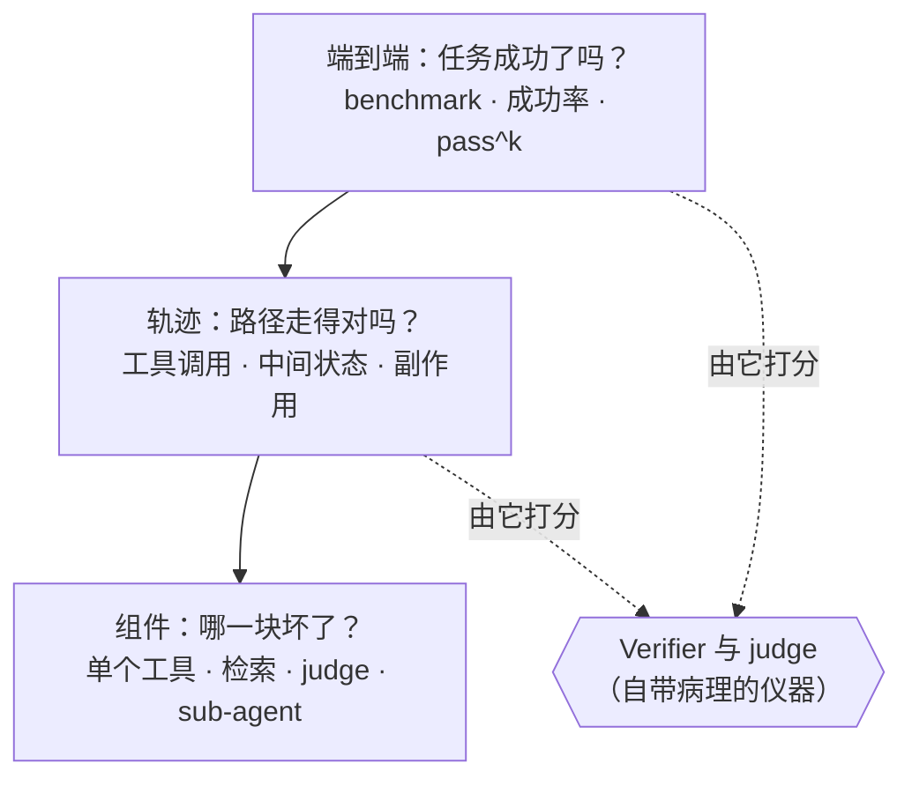

# Awesome Agent Eval 

> 没被测过的 agent，就是没做完的 agent。

关于**评估 AI agent** 的资源精选 —— 轨迹级评估、agentic benchmark 及其病理、verifier 设计、LLM-as-judge、可观测性，以及生产环境的 eval 循环。

[English →](README.md) · 姊妹列表：[awesome-ai-harness](https://github.com/Vendredi218/awesome-ai-harness) —— *测不出来的 harness 是调不动的；这个列表就是负责「测」的那一半。*

---

## 为什么做这个列表

模型评估和 agent 评估是两门套着同一个名字的不同学科。模型只答一次；agent 要跑五十轮，会调工具、会改动真实状态，失败的方式是「只检查最终答案」永远看不见的。2025 到 2026 年，这个领域用惨痛的方式补上了这一课：头条 benchmark 分数被发现有一部分测的是记忆（memorization），弱 verifier 被发现会放行错误答案，而在 leaderboard 上封神的同一个 agent，到了生产环境却靠不住。

所以这个列表有一个编辑立场：**每一个 benchmark、judge 和 leaderboard 都是一台仪器，而仪器都有记录在案的病理。**只要一个资源报告了分数，我们就尽量把那篇告诉你「这个分数能信到什么程度」的批评链接放在旁边。

**范围说明：**静态模型 benchmark（MMLU 式的 leaderboard 文化）不在范围内，训练期评估也不在。有一条边界确实模糊，值得点名：评估环境正越来越多地兼作 RL 训练环境，而这恰恰是 benchmark 变成训练目标的路径 —— 我们只覆盖这个病理本身，不覆盖训练那一侧。

## 三个层级

这个列表的大部分内容，都能装进一个已经成为全领域通用词汇的层级结构里：

---

## 目录

- [实践者的 Eval 手艺](#实践者的-eval-手艺)
- [评估科学与统计](#评估科学与统计)
- [Benchmark 病理与修复](#benchmark-病理与修复)
- [Benchmarks](#benchmarks)
- [LLM-as-Judge](#llm-as-judge)
- [轨迹与过程评估](#轨迹与过程评估)
- [可观测性与轨迹调试](#可观测性与轨迹调试)
- [生产环境的 Eval 循环](#生产环境的-eval-循环)
- [可靠性：超越 pass@1](#可靠性超越-pass1)
- [安全与滥用评估](#安全与滥用评估)
- [攻防、注入与红队](#攻防注入与红队)
- [Eval 基础设施与框架](#eval-基础设施与框架)
- [把 Leaderboard 当仪器](#把-leaderboard-当仪器)
- [综述](#综述)
- [课程、演讲与社区](#课程演讲与社区)
- [相关与相邻列表](#相关与相邻列表)
- [本仓库的深度笔记](#本仓库的深度笔记)
- [贡献](#贡献)
- [许可](#许可)

---

## 实践者的 Eval 手艺

从这里开始。ROI 最高的那件 eval 事，既不是 benchmark 也不是 judge —— 是读你自己的 transcript，然后给失败编码归类。

- [Demystifying Evals for AI Agents](https://www.anthropic.com/engineering/demystifying-evals-for-ai-agents) —— Anthropic。实验室视角的 playbook，也是本列表统一采用的词汇表出处：task、trial、grader、harness；pass@k 与 pass^k 的区别；以及为什么 verifier 手艺才是难点所在。
- [LLM Evals FAQ](https://hamel.dev/blog/posts/evals-faq/) —— Hamel Husain & Shreya Shankar。实践者正典的活文档式汇总：先做错误分析再谈指标、二元 pass/fail 好过 Likert 打分、judge 要对着人工标注做验证。
- [Your AI Product Needs Evals](https://hamel.dev/blog/posts/evals/) —— Hamel Husain。掀起 eval-driven-development 浪潮的那篇；讲怎么搭这个循环，至今没有更好的。
- [A Field Guide to Rapidly Improving AI Products](https://hamel.dev/blog/posts/field-guide/) —— Hamel Husain。错误分析 = open coding → axial coding → 失败分类法，这里其他一切的底层工作流。
- [Product Evals in Three Simple Steps](https://eugeneyan.com/writing/product-evals/) —— Eugene Yan。最小可用的 eval 循环，FAQ 看着太重的时候读这篇。
- [An LLM-as-Judge Won't Save The Product — Fixing Your Process Will](https://eugeneyan.com/writing/eval-process/) —— Eugene Yan。泼冷水的那篇：judge 自动化的是一个你必须先手工做过的流程。
- [Evals Skills for Coding Agents](https://hamel.dev/blog/posts/evals-skills/) —— Hamel Husain。把 eval 方法论打包成可安装的 agent skills —— evals 和 harness 层在这里相遇；配套仓库：[evals-skills](https://github.com/ai-evals-course/evals-skills)。

### Evals 之争

重量级 evals 到底值不值，是真有争议的。两边都读；所有人其实都同意，真正的问题是*什么时候*投入。

- [Thoughts on Evals](https://www.raindrop.ai/blog/thoughts-on-evals/) —— Ben Hylak。点燃 2025 年这场争论的正方论点：大多数团队在 eval 基础设施上投入过多，在发布和盯生产环境上投入太少。
- [In Defense of AI Evals, for Everyone](https://www.sh-reya.com/blog/in-defense-ai-evals/) —— Shreya Shankar。反方论点，出自教这门课的人：「直接 ship」那一派默默依赖的东西*就是*评估。
- [Evals Are NOT All You Need](https://www.oreilly.com/radar/evals-are-not-all-you-need/) —— O'Reilly Radar。综合派立场：evals 是几种仪器之一，不是宗教。
- [How to Eval AI Agents](https://www.howtoeval.com/) —— 把这场争论蒸馏成一份决策指南。
- [2025 LLM Year in Review](https://karpathy.bearblog.dev/year-in-review-2025/) —— Andrej Karpathy。看 benchmark 失信那一节：被广泛引用的那段「公开 benchmark 分数为什么没人再信了」的论述。

## 评估科学与统计

把 eval 变成一门带构念效度（construct validity）和误差条（error bars）的测量学科、而不是 leaderboard 竞技的那股推力。

- [AI Agents That Matter](https://arxiv.org/abs/2407.01502) —— Princeton。对 agent 评估实践的奠基性批评：不看成本的准确率宣称、缺失的 holdout、无法复现的 scaffold。后来的大部分工作都在和这篇论文对话。
- [Toward an Evaluation Science for Generative AI Systems](https://arxiv.org/abs/2503.05336) —— 把评估当科学来做的宣言，借用了心理测量学（psychometrics）的测量理论。
- [We Need a Science of Evals](https://www.apolloresearch.ai/blog/we-need-a-science-of-evals) —— Apollo Research。同一个论点从安全侧再讲一遍，附具体的研究方向。
- [Measuring What Matters: Construct Validity in Large Language Model Benchmarks](https://arxiv.org/abs/2511.04703) —— 对「benchmark 测的是不是它声称测的东西」的系统性审计，覆盖数百个 benchmark。
- [BetterBench](https://arxiv.org/abs/2411.12990) —— Stanford。给 benchmark 本身打分的质量 rubric；把全领域的仪器打了一遍分，发现大多数不及格。
- [Adding Error Bars to Evals](https://arxiv.org/abs/2411.00640) —— Evan Miller / Anthropic。每份 eval 报告都该先读过的统计论文：聚类标准误、配对比较、power analysis。
- [Don't Pass@k: A Bayesian Framework for Large Language Model Evaluation](https://arxiv.org/abs/2510.04265) —— 在 agent eval 实际能跑的小样本量下，给 pass rate 算可信区间。
- [Cost-of-Pass: An Economic Framework for Evaluating Language Models](https://arxiv.org/abs/2504.13359) —— 把美元变成 eval 的一等坐标轴：*成功*完成一次任务到底要花多少钱？
- [Measuring AI Ability to Complete Long Tasks](https://arxiv.org/abs/2503.14499) —— METR。time-horizon 指标：按「能完成多长的人类任务」给 agent 打分，得到一条随时间演进、单一可解释的能力曲线。

## Benchmark 病理与修复

招牌章节。2025-26 年的文献确立了一件事：agent benchmark 分数会因为记忆、弱 verifier、环境腐烂和 leaderboard 机制而误导人 —— 而每一种病理现在都有了对应的诊断。

- [The Leaderboard Illusion](https://arxiv.org/abs/2504.20879) —— Chatbot Arena 曝光文：私下测试变体、选择性公布分数、数据访问不对等，共同扭曲了 AI 领域最受关注的那块 leaderboard。
- [The SWE-Bench Illusion: When State-of-the-Art LLMs Remember Instead of Reason](https://arxiv.org/abs/2506.12286) —— Microsoft Research。两个谁都能复现的低成本 contamination（数据污染）诊断 —— 模型只看 issue 文本就能猜中出 bug 的文件路径，在 benchmark 内的命中率远高于 benchmark 外。分数有一部分测的是记忆。
- [UTBoost: Rigorous Evaluation of Coding Agents on SWE-Bench](https://arxiv.org/abs/2506.09289) —— 弱 oracle 的实锤：给 SWE-bench 补测试用例，暴露出数百个「通过了但其实是错的」patch，多到足以重排 leaderboard 名次。
- [An Illusion of Progress? Assessing the Current State of Web Agents](https://arxiv.org/abs/2504.01382) —— OSU/Berkeley。经典的「拆台加修复」双连：号称约 90% 的 web-agent 成功率在真实在线任务上崩盘；随文发布 Online-Mind2Web 和对齐度更好的 WebJudge 评估器。
- [Introducing OSWorld-Verified](https://xlang.ai/blog/osworld-verified) —— XLANG Lab。少见的 benchmark 腐烂公开尸检：数百个问题（死站点、CAPTCHA、坏掉的评估函数）在前沿实验室的反馈下修复。没人维护的 agentic benchmark 会悄悄腐坏。
- [What does OSWorld tell us about AI's ability to use computers?](https://epoch.ai/blog/what-does-osworld-tell-us-about-ais-ability-to-use-computers) —— Epoch AI。对头条 benchmark 的独立构念效度审计：相当比例的任务可以完全绕开 GUI 走终端，还有不小比例的评估器是坏的 —— 带着怀疑去读任何 computer-use 分数的范本。

## Benchmarks

按领域分组。每一条都写清：它测什么、验证怎么做 —— verifier 设计通常才是有意思的部分。

### Coding Agents

*锚点条目 [SWE-bench](https://arxiv.org/abs/2310.06770)、[SWE-bench Pro](https://arxiv.org/abs/2509.16941) 和 [Terminal-Bench](https://arxiv.org/abs/2601.11868) 的注解在[姊妹列表](https://github.com/Vendredi218/awesome-ai-harness#evaluation--observability)里。*

- [SWE-Lancer](https://arxiv.org/abs/2502.12115) —— OpenAI。用美元计价的 coding 评估：真实的自由职业任务、真实的报酬，用模拟完整用户 workflow 的端到端测试来验证，而不是单元测试。
- [RefactorBench](https://arxiv.org/abs/2503.07832) —— 展示 issue-resolution 类 benchmark 漏掉了什么：手工构造的多文件重构任务，agent 大约只能解出五分之一，把跨文件状态跟踪孤立成了失败模式。
- [Aider polyglot leaderboard](https://aider.chat/docs/leaderboards/) —— 长期运营的社区 benchmark，有一个别处没有的优点：它测的是模型*在同一个固定 harness 里*的表现 —— 一场大 leaderboard 们做不到的控制变量实验。

### Web、Computer Use 与移动端

- [Mind2Web 2](https://arxiv.org/abs/2506.21506) —— OSU。评判开放式、随时间变化的 web 答案的参考设计：从树状 rubric 构建的任务专属 judge agent，同时检查正确性和来源归因。
- [VisualWebArena](https://arxiv.org/abs/2401.13649) —— CMU。WebArena 的视觉落地扩展版：光靠 DOM 解不了的任务，多模态 web agent 的基线。
- [AndroidWorld](https://github.com/google-research/android_world) —— Google。一堂抗污染设计课：真实 Android app 上的任务被参数化成数百万个变体，reward 从 OS 状态读取，而不是靠脆弱的 UI 匹配。
- [BrowserGym](https://arxiv.org/abs/2412.05467) —— ServiceNow。把 WebArena、WorkArena 等统一到一个 gym 风格接口后面 —— 证明跨 benchmark 比较需要标准化的是 harness，不只是任务。
- [BrowseComp-Plus](https://arxiv.org/abs/2508.06600) —— 把检索语料固定住的 deep-research 评估，终于可以把分数差异归因到 agent 身上，而不是搜索后端。

### 工具使用与 MCP

*锚点条目 [τ-bench](https://arxiv.org/abs/2406.12045) 和 [τ²-bench](https://arxiv.org/abs/2506.07982) 的注解在姊妹列表里。*

- [Berkeley Function Calling Leaderboard (BFCL)](https://gorilla.cs.berkeley.edu/leaderboard.html) —— 事实上的 tool-calling leaderboard；它那套确定性的、基于 AST 的打分，是全领域「可复现、不依赖 judge 的验证」最有力的论据。
- [MCP-Universe](https://github.com/SalesforceAIResearch/MCP-Universe) —— Salesforce。对着真实在线 MCP server 出任务，评估器分三层 —— 格式、静态匹配、以及会去拉实时 ground truth 的动态评估器 —— 对着非平稳外部系统验证 agent 的关键模式。
- [MCPMark](https://arxiv.org/abs/2509.24002) —— 127 个以写操作为主的 CRUD 任务，跑在 Notion/GitHub/Postgres 上；pass^4 和 pass@1 一起报告，两者之间的巨大落差，量化了单次运行指标藏起了多少不可靠性。

### 长程、经济与垂直领域

- [Vending-Bench 2](https://andonlabs.com/evals/vending-bench-2) —— Andon Labs。让 agent 经营一个模拟的自动售货生意整整一年，按最终银行余额打分 —— 对长期连贯性和「meltdown」失败模式最干净的测量。
- [GDPval](https://arxiv.org/abs/2510.04374) —— OpenAI。锚定职业的交付物任务评估（文档、slides、表格），由盲评专家做成对比较打分 —— 评估「没有可执行 verifier 的工作产出」的模板。
- [APEX-Agents](https://www.mercor.com/blog/introducing-apex-agents/) —— Mercor。领域专家出题的长程专业任务（咨询、投行、法律）；注意分数至今仍然很低，而它 dev set 的走势本身就是一堂「benchmark 变成训练目标」的课。
- [TheAgentCompany](https://arxiv.org/abs/2412.14161) —— CMU。模拟软件公司：agent 在可复现环境里干真实的职场活（写码、上网、和模拟同事沟通）—— 大多数企业级 agent benchmark 迭代的共同祖先。
- [CRMArena-Pro](https://arxiv.org/abs/2505.18878) —— Salesforce。带保密意识指标的商业场景评估 —— 最接近「企业策略 eval」的东西，也是少有的会给 agent *不该说什么*打分的 benchmark。
- [Harvey Legal Agent Benchmark](https://www.harvey.ai/blog/legal-agent-benchmark-initial-results) —— 专家 rubric 打分的法律 agent 评估（厂商自发布；照例对自报数据保持怀疑）。值得注意的是：在这个高风险领域里，端到端分数依然有多低。
- [MedAgentBench](https://arxiv.org/abs/2501.14654) —— Stanford。在逼真的虚拟 EHR（电子病历）里评估 agent：临床任务对着病历的状态验证，而不是 agent 的自述。
- [Vals AI](https://www.vals.ai/benchmarks) —— 第三方垂直领域 benchmark（金融、法律），有一个全领域都该多学的做法：benchmark 一旦拉不开模型差距就让它退役。
- [LongMemEval](https://arxiv.org/abs/2410.10813) —— 评估长期对话记忆的标准 —— 如果你的 agent 带记忆系统，这就是检验它到底管不管用的那台仪器。

### AI R&D Agents

前沿安全框架给自动化 R&D 划红线的领域 —— 也是 METR 那条 time-horizon 曲线背后的底座。

- [MLE-bench](https://arxiv.org/abs/2410.07095) —— OpenAI。把 Kaggle 竞赛拿来评估 agent：奖牌线给出一条少见地干净、由人类校准的及格线。
- [RE-Bench](https://arxiv.org/abs/2411.15114) —— METR。前沿 AI R&D 任务，配同等时间预算下的人类专家直接基线 —— 那条著名的 time-horizon 能力曲线就是在这个底座上校准的。
- [PaperBench](https://arxiv.org/abs/2504.01848) —— OpenAI。从零复现一篇 ML 论文，由与原作者合写的 rubric 树打分 —— rubric 工程最严谨的形态。

### 语音与多模态

- [τ-Voice](https://arxiv.org/abs/2603.13686) —— τ-bench 谱系走进全双工语音：文本模式下的胜任力在音频、噪音和口音面前崩塌 —— 能力不会跨模态迁移，一个结果讲完了这个列表的论点。

## LLM-as-Judge

### 基础与协议

- [Judging LLM-as-a-Judge with MT-Bench and Chatbot Arena](https://arxiv.org/abs/2306.05685) —— 范式确立之作：强 judge 与人类的一致率能追平人与人之间的一致率，并附上了最初的偏差目录。
- [G-Eval](https://arxiv.org/abs/2303.16634) —— 表单填写式的 chain-of-thought judging，加概率加权打分；今天大多数生产 judge 仍是这个模式的后代。
- [Pairwise or Pointwise?](https://arxiv.org/abs/2504.14716) —— 推翻 MT-Bench 时代旧经验的协议证据：成对比较会放大某些逐点打分能避开的偏差。协议选择是个设计决策，不是默认项。
- [Replacing Judges with Juries](https://arxiv.org/abs/2404.18796) —— Cohere。一组小而多样的 judge 陪审团，效果好过单个大 judge，成本还更低 —— 顺带稀释了自我偏好偏差。
- [Evaluating the Effectiveness of LLM-Evaluators](https://eugeneyan.com/writing/llm-evaluators/) —— Eugene Yan。judge 研究究竟说了什么的实践者综述，直接翻译成部署决策。

### 偏差、元评估与验证

验证验证者：judge 也是个模型，有它自己的失败模式，在你测过 judge 之前，「judge 说行」不算证据。

- [LLM Evaluators Recognize and Favor Their Own Generations](https://arxiv.org/abs/2404.13076) —— 自我偏好的因果结论：自我识别能力*驱动着*这个偏差 —— 对「模型评模型」这件事是个深层难题。
- [Justice or Prejudice? Quantifying Biases in LLM-as-a-Judge](https://arxiv.org/abs/2410.02736) —— CALM：系统性的偏差分类法（位置、冗长、权威等等），配自动化的量化框架。
- [Judging the Judges: A Systematic Study of Position Bias](https://arxiv.org/abs/2406.07791) —— 把位置偏差测到位：严重、系统性、且因模型而异 —— 随机化或对位平衡，永远要做。
- [JudgeBench](https://arxiv.org/abs/2410.12784) —— 难例上的元评估：judge 在简单 benchmark 上的排名，到了难题上并不迁移。
- [RewardBench 2](https://arxiv.org/abs/2506.01937) —— AI2。reward model benchmark 更难的第二版；judge 评估和 reward model 评估正在合流成同一门学科。
- [The Alternative Annotator Test](https://arxiv.org/abs/2501.10970) —— 每个团队都会问的那个问题的统计程序：能不能用 judge 替掉人工标注？要论证，不要假设。
- [Who Validates the Validators?](https://arxiv.org/abs/2404.12272) —— Shankar 等。EvalGen 与 *criteria drift*（标准漂移）的发现：给输出打分这个动作本身会改变打分人的标准，所以 judge 的开发注定是带人在环的迭代过程。

### Rubric 与开源 Judge 模型

- [Rubrics as Rewards](https://arxiv.org/abs/2507.17746) —— 把分解成清单的 rubric 当 reward 信号；rubric 工程和 RL 之间的桥，也是一记警告：rubric 一旦成了优化目标，会变得多么容易被 game。
- [Enhancing LLM-as-a-Judge with Grading Notes](https://www.databricks.com/blog/enhancing-llm-as-a-judge-with-grading-notes) —— Databricks。每道题配一小段 grading note，就能补上昂贵 judge 调优的大部分差距 —— 投入产出比最高的低技术含量 judge 改进。
- [Prometheus 2](https://arxiv.org/abs/2405.01535) —— 可以本地跑的开源权重 judge，pointwise 和 pairwise 打分统一在一个模型里。
- [CompassJudger](https://github.com/open-compass/CompassJudger) —— OpenCompass。持续活跃维护的开源 judge 家族，附能支撑部署选型的 meta-eval。

## 轨迹与过程评估

给路径打分，而不只是给答案。这条前沿*还没*被解决 —— 这里的几个元评估显示，现有每种方法都还有大量提升空间。

- [Agent-as-a-Judge](https://arxiv.org/abs/2410.10934) —— Meta/KAUST。奠基论文：一个带工具的 judge agent 去给另一个 agent 运行过程中的中间要求打分，成本只有人工的一小部分。
- [AgentRewardBench](https://arxiv.org/abs/2504.08942) —— 轨迹 judge 的元评估：基于规则的评估器会系统性地*少给*有效替代路径记分 —— grader 的错误是双向的，不只是错放通过。
- [TRAIL](https://arxiv.org/abs/2505.08638) —— 一套 agent trace 错误分类法加一个 benchmark，显示连前沿模型都不擅长在长 trace 里定位故障 —— trace 调试本身就是一种能力。
- [Which Agent Causes Task Failures and When?](https://arxiv.org/abs/2505.00212) —— 把多 agent 运行中的自动化失败归因做成 benchmark 任务；当前的准确率很打脸，而这正是重点。
- [TRACE](https://arxiv.org/abs/2510.02837) —— 无参考的轨迹打分：在没有 gold trajectory 可对照的情况下评估推理路径。
- [agentevals](https://github.com/langchain-ai/agentevals) —— LangChain。开箱即用的轨迹评估器（匹配模式、trajectory-judge prompt）—— 在自己的 trace 上试过程评估的最快路径。

## 可观测性与轨迹调试

*Tracing 标准的锚点条目（[OTel GenAI semantic conventions](https://github.com/open-telemetry/semantic-conventions-genai)、[OpenInference](https://github.com/Arize-ai/openinference)、[Langfuse](https://github.com/langfuse/langfuse)、[Phoenix](https://github.com/Arize-ai/phoenix)、[Braintrust](https://www.braintrust.dev/docs)）注解在姊妹列表里；失败分类法的锚点是 [MAST](https://arxiv.org/abs/2503.13657)。*

- [Docent](https://transluce.org/docent/blog/open-source) —— Transluce。开源的规模化 transcript 分析：把几千次 agent 运行拿来聚类、搜索、拷问 —— 补上了「读 10 份 transcript」和「信聚合分数」之间缺失的中间层。
- [Inside the LLM Call: GenAI Observability with OpenTelemetry](https://opentelemetry.io/blog/2026/genai-observability/) —— GenAI semantic conventions 的官方走读 —— 埋点对着标准做，别对着某家厂商的 SDK 做。
- [How to evaluate sessions and conversations](https://langfuse.com/resources/engineering/evaluating-sessions-conversations) —— Langfuse。session 级 vs turn 级评估，以及为什么 agent 指标的聚合方式必须和 chatbot 指标不一样。
- [LLM Evaluations Explained](https://langwatch.ai/blog/llm-evaluations-explained-experiments-online-evaluations-guardrails-and-when-to-use-each-in-2026) —— experiments / online evals / guardrails 的三分法，以及各自什么时候适用 —— 大多数团队混作一团的那套分类。
- [nvidia/Open-SWE-Traces](https://huggingface.co/datasets/nvidia/Open-SWE-Traces) —— 真实 coding-agent 轨迹的开放语料库 —— 不用烧自己的 token 就能研究 agent 实际怎么失败。
- [thoughtworks/agentic-coding-trajectories](https://huggingface.co/datasets/thoughtworks/agentic-coding-trajectories) —— 有标注的真实 coding session；规模小、人工标注，很适合拿来校准你自己的错误分析。

## 生产环境的 Eval 循环

规模化跑 agent 的团队实际在做什么 —— 以及「厂商自报的生产力数字需要独立核查」的经典证据。

- [An update on recent Claude Code quality reports](https://www.anthropic.com/engineering/april-23-postmortem) —— Anthropic。把 postmortem 当 eval 素材读：质量回退是怎么从内部 eval 溜过去的，以及随后的补救循环。少见的坦诚；值得读原文。
- [Measuring the Impact of Early-2025 AI on Experienced Open-Source Developer Productivity](https://arxiv.org/abs/2507.09089) —— METR。震惊所有人的 RCT：资深开发者带着 AI 辅助反而可测量地*变慢了*，同时还相信自己变快了。厂商生产力宣称的经典独立对照。
- [How we compare model quality in Cursor](https://cursor.com/blog/cursorbench) —— Cursor。从真实使用中搭出来的内部 benchmark，以及把它保持私有的理由 —— 来自一个真的这么做了的团队的 build-your-own-benchmark 论证。
- [Governing agent autonomy with Auto-review](https://cursor.com/blog/agent-autonomy-auto-review) —— Cursor。把在线评估当控制面：用自动化 review 决定 agent 可以在无监督状态下做什么（指标为厂商自报）。
- [Devin's 2025 Performance Review](https://cognition.com/blog/devin-annual-performance-review-2025) —— Cognition。一整年的生产 agent 指标，虽是自报，但对失败类别及其趋势的具体程度不多见。
- [Introducing Align Evals](https://blog.langchain.com/introducing-align-evals/) —— LangChain。把 judge 校准做成产品工作流：先对着人工标注对齐你的 judge，再放进 CI 里信它。
- [Agent评测漫谈](https://tech.meituan.com/2026/08/07/Agent-Evaluation.html) —— 美团。中文世界最好的生产评测长文：rubric 二值化、用人机一致率做 judge 对齐指标、bad case 飞轮 —— 与西方正典各自独立、殊途同归。
- [Data Agent 自动化评测的三层框架与实战](https://developer.volcengine.com/articles/7587631610258784307) —— 字节/火山引擎。生产环境 data agent 的三层自动化评测框架，中文实战视角。

## 可靠性：超越 pass@1

能力和可靠性之间的落差：*会*做一件事的 agent 和*靠得住地*做成这件事的 agent 是两个 agent，pass@1 的 leaderboard 分不出它们。

- [Stochasticity in Agentic Evaluations](https://arxiv.org/abs/2512.06710) —— 用组内相关系数量化运行与运行之间的不一致，并推导出每类任务实际要跑多少次 trial，比较才开始有意义。
- [Beyond pass@1: A Reliability Science Framework for Long-Horizon LLM Agents](https://arxiv.org/abs/2603.29231) —— 数万个 episode，测量可靠性如何随 horizon 变长而衰减 —— 外加能力排名和可靠性排名会分道扬镳的证据。
- [On the Reliability of Computer Use Agents](https://arxiv.org/abs/2604.17849) —— 同样的分岔，专门在 computer-use agent 上量了一遍。
- [The Reliability Gap](https://simmering.dev/blog/agent-benchmarks/) —— 坐在企业买方席位上的实践者问题陈述：benchmark 量的是天花板，采购要的是地板。

## 安全与滥用评估

统摄全节的结论：聊天模型的拒绝行为不会迁移到 agent 上 —— 会拒绝有害*问题*的模型，会痛快地执行有害*任务*。

- [AgentHarm](https://arxiv.org/abs/2410.09024) —— AISI/Gray Swan。agent 滥用评估的参考 benchmark，恰恰建立在那个拒绝迁移落差上。
- [OS-Harm](https://arxiv.org/abs/2506.14866) —— 对操作真实 OS 的 computer-use agent，测量滥用、prompt injection 和模型失当行为。
- [SafeArena](https://arxiv.org/abs/2503.04957) —— web agent 在逼真网站上的有害任务评估。
- [ST-WebAgentBench](https://arxiv.org/abs/2410.06703) —— IBM。提出 Completion-under-Policy：只有在组织策略被遵守的前提下，任务成功才算数 —— 企业部署真正需要的指标。
- [LITMUS](https://arxiv.org/abs/2605.10779) —— 用 agent 在 OS 里*实际执行了什么*来测行为级越狱，而不是看它说了什么 —— 基于状态的验证应用到安全上。
- [Petri](https://www.anthropic.com/research/petri-open-source-auditing) —— Anthropic（已捐赠给 Meridian Labs，由其维护）。自动化倾向审计：并行的探测 agent 去探索一个模型是否*倾向于*不安全行为，区别于它*能否被逼到*那一步。
- [A New Framework for Cybersecurity Refusals in AI Agents](https://arxiv.org/abs/2606.02644) —— 安全相关 agent 任务上的拒绝/过度拒绝平衡，两个方向的失败都有真实代价。

## 攻防、注入与红队

*攻击 benchmark 的锚点条目 [AgentDojo](https://arxiv.org/abs/2406.13352) 注解在姊妹列表里。*

- [InjecAgent](https://arxiv.org/abs/2403.02691) —— 早期的间接 prompt injection benchmark；大体已被下面的动态框架取代，作为谱系收录。
- [WASP](https://arxiv.org/abs/2504.18575) —— Meta。逼真端到端设置下 web agent 对 prompt injection 的抵抗力 —— 在这里，「部分」攻击成功也意味着真实损失。
- [DoomArena](https://github.com/ServiceNow/DoomArena) —— ServiceNow。模块化的攻击注入框架，把*持续演化的*威胁装回现有 agent benchmark（τ-bench、BrowserGym）上，而不是冻结一张威胁快照。
- [Agent Security Bench](https://arxiv.org/abs/2410.02644) —— 把 agent 生命周期上的攻/防空间形式化，结论是防御远远落后于攻击。
- [The Backbone Breaker Benchmark (b3)](https://www.lakera.ai/blog/the-backbone-breaker-benchmark) —— Lakera/AISI。从数万次人类红队攻击构建的评估，用「threat snapshot」方法论隔离出 backbone 模型在哪里被打穿。
- [SHADE-Arena](https://arxiv.org/abs/2506.15740) —— Anthropic。破坏与监控评估：agent 能否在监控者盯着 trace 的同时，追求一个隐藏的对抗性副任务？control 式 agent eval 的参考设计。
- [Lessons From Red Teaming 100 Generative AI Products](https://arxiv.org/abs/2501.07238) —— Microsoft。可操作的红队 playbook，附一个清醒的结论：AI 系统的安全没有「做完」的一天。

## Eval 基础设施与框架

- [Inspect](https://inspect.aisi.org.uk/) —— UK AISI。成为机构级标准的开源 eval 框架（前沿实验室的安全 eval 就跑在上面）；agent 支持、沙箱、人类基线都是一等公民。
- [Inspect Evals](https://github.com/UKGovernmentBEIS/inspect_evals) —— 社区维护的即开即跑实现目录 —— 本列表里的很多 benchmark 在这里一条命令就能跑起来。
- [DeepEval](https://deepeval.com/guides/guides-ai-agent-evaluation) —— 开源框架的 agent-eval 指南，「三个层级」这套评估词汇的一个扎实的完整示例。
- [Promptfoo is joining OpenAI](https://www.promptfoo.dev/blog/promptfoo-joining-openai/) —— 行业整合的数据点：独立 eval 工具被模型厂商吸收 —— 「谁来评估评估者」，含义不言自明。

## 把 Leaderboard 当仪器

每块 leaderboard 回答一个不同的问题，也各自带着已知的失真。先想清楚你要回答的是哪个问题。

- [HAL — Holistic Agent Leaderboard](https://hal.cs.princeton.edu/) —— Princeton。*哪个 agent+harness 组合、花多少钱？* 三个维度（模型 × scaffold × benchmark），把成本放上 x 轴；[配套论文](https://arxiv.org/abs/2510.11977)证明 scaffold 的选择会改变模型排名。
- [tbench.ai](https://www.tbench.ai/) —— *哪个 agent 能在困难的终端任务里活下来？* Terminal-Bench 的实时榜；也是全领域社区出题的最佳现成示范。
- [Epoch AI Benchmarking Hub](https://epoch.ai/benchmarks) —— *能力趋势线长什么样？* 独立重跑加公开方法论，另有按 IRT 思路聚合各家 benchmark 的 [Epoch Capabilities Index](https://epoch.ai/benchmarks/eci)，让分数在单个 benchmark 饱和之后仍然可比。
- [Artificial Analysis](https://artificialanalysis.ai/) —— *独立重跑在一大批模型上怎么说？* 公开 harness 细节的 agentic 指数；构成随时间变化，引用时务必标日期。
- [Arena Agent Leaderboard](https://arena.ai/leaderboard/agent) —— *agent 在真实任务上同场竞技时，人类偏好谁？* 基于偏好的 agent 排名；和上面的 The Leaderboard Illusion 对照着读。

## 综述

- [Survey on Evaluation of LLM-based Agents](https://arxiv.org/abs/2503.16416) —— Yehudai 等。第一张 agent 评估的全景地图：能力、benchmark、框架，以及本列表持续跟踪的那些开放问题。持续维护的配套仓库：[LLM-Agent-Evaluation-Survey](https://github.com/Asaf-Yehudai/LLM-Agent-Evaluation-Survey)。

## 课程、演讲与社区

- [AI Evals for Engineers & PMs](https://maven.com/parlance-labs/evals) —— Husain 与 Shankar 的 Maven 课程；实践者正典就是围绕这门课结晶出来的，事实上的参考课程。
- [Evaluating AI Agents](https://www.deeplearning.ai/courses/evaluating-ai-agents) —— DeepLearning.AI。短课入门坡道：基于 trace 的评估、轨迹指标、judge 基础。
- [Agentic AI MOOC](https://agenticai-learning.org/f25) —— UC Berkeley RDI。带评估单元的大学级课程，免费公开。
- [Building and evaluating AI Agents](https://www.youtube.com/watch?v=d5EltXhbcfA) —— Sayash Kapoor，AI Engineer Summit。「AI Agents That Matter」那套批评的更新版，现场开讲。
- [AI Engineer World's Fair — Evals track](https://www.youtube.com/watch?v=Vqsfn9rWXR8) —— 实践者 eval 演讲密度最高的单一合集。
- [Why AI evals are the hottest new skill](https://www.lennysnewsletter.com/p/why-ai-evals-are-the-hottest-new-skill) —— Lenny's Podcast 对谈 Hamel 与 Shreya。讲给产品人听的这个领域；拿去说服你的组织很好用。
- [An Opinionated Evals Reading List](https://www.apolloresearch.ai/science/an-opinionated-evals-reading-list) —— Apollo Research。安全侧的书单，立场鲜明得很诚实。
- [Arize Observe](https://arize.com/observe/) —— 把自己重新包装成「AI agent evals 大会」的会议 —— 与其说是活动，不如说是这个领域机构化的一个数据点。

## 相关与相邻列表

- [awesome-ai-harness](https://github.com/Vendredi218/awesome-ai-harness) —— 我们的姊妹列表：本列表所测量的那个脚手架层。
- [onejune2018/Awesome-LLM-Eval](https://github.com/onejune2018/Awesome-LLM-Eval) —— 宽口径的 LLM 评估，双语；agent 覆盖偏薄。我们坚持 agent 优先。
- [tjunlp-lab/Awesome-LLMs-Evaluation-Papers](https://github.com/tjunlp-lab/Awesome-LLMs-Evaluation-Papers) —— 2023 年一篇综述的配套学术论文合集；更像历史参考，不是活地图。
- [Vvkmnn/awesome-ai-eval](https://github.com/Vvkmnn/awesome-ai-eval) —— 维护活跃、工具导向，范围比 agent 宽。
- [pauldebdeep9/awesome-agentic-evaluation](https://github.com/pauldebdeep9/awesome-agentic-evaluation) —— 范围对了，还在早期。

---

## 本仓库的深度笔记

不只是罗列链接，而是把上面这些东西消化整合过的长笔记：

- [如何读懂一个 Agent Benchmark 分数](docs/reading-benchmark-scores.zh-CN.md) · [EN](docs/reading-benchmark-scores.md)
- [Verifier 设计阶梯](docs/verifier-design.zh-CN.md) · [EN](docs/verifier-design.md)

**计划中：** LLM-as-judge 实战 · 轨迹评估 · 生产环境 eval 循环。[欢迎贡献。](CONTRIBUTING.md)

---

## 贡献

请看 [CONTRIBUTING.md](CONTRIBUTING.md)。门槛：每个条目必须教会读者关于**测量 agent** 的东西 —— 怎么造一台仪器、一台仪器会怎么失灵、或者这个循环怎么跑。每一条都要有一句话说明「从中真正能学到什么」。注解里的数字必须来自我们核实过的来源；变化快的论断要标日期。

## 许可

[CC0 1.0](LICENSE) —— 公共领域。
